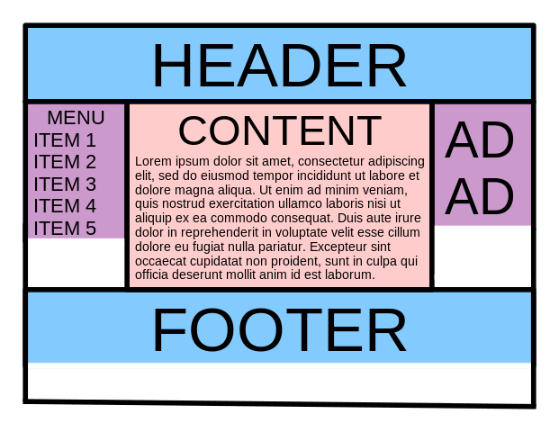

# Holy Grail

In web design, a “[holy grail](https://en.wikipedia.org/wiki/Holy_grail_(web_design))” refers to a web page layout which has multiple, equal height columns that are defined with style sheets.

Build this layout, and describe the tradeoffs you’ve made in designing it.

## Example

_Photo by David Lark, distributed by CC BY 4.0_

HINTS

- ask your peer to describe various ways this might be done, and the tradeoffs for each
- if your peer doesn’t suggest using either Flexbox or CSS3 Grid layout, help them choose one of these solutions
- make sure the design is also responsive, if your peer doesn’t mention it first

 

ANSWER

There are many great implementations of this layout available for reference, each with its own set of tradeoffs.

Here is my attempt:

- [My solution code](solution)

Here are a selected few:

- [This example](https://philipwalton.github.io/solved-by-flexbox/demos/holy-grail/) using Flexbox
- [This example](https://css-tricks.com/books/volume-i/holy-grail-layout-5-lines-css/) using CSS Grid

A few interactive examples:

- [Flexbox 1](https://codepen.io/mynoralexander/pen/OVGLmo)
- [Flexbox 2](https://codepen.io/catheraaine/pen/vGemrK)
- [Flexbox 3](https://codepen.io/thedigitalman/pen/rAHCj)
- [CSS Grid](https://codepen.io/geoffgraham/pen/yPYKzw)

